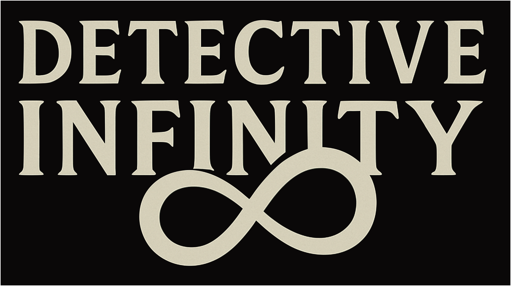
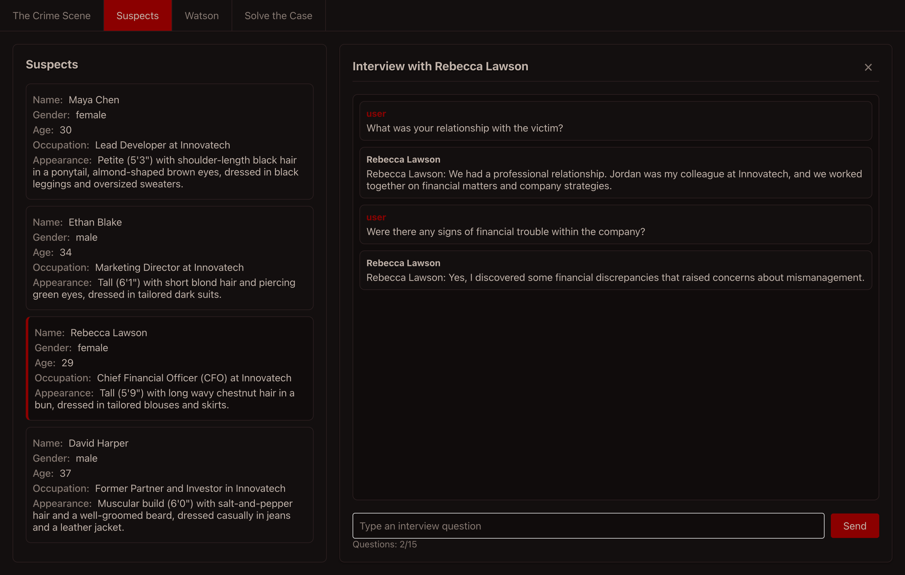
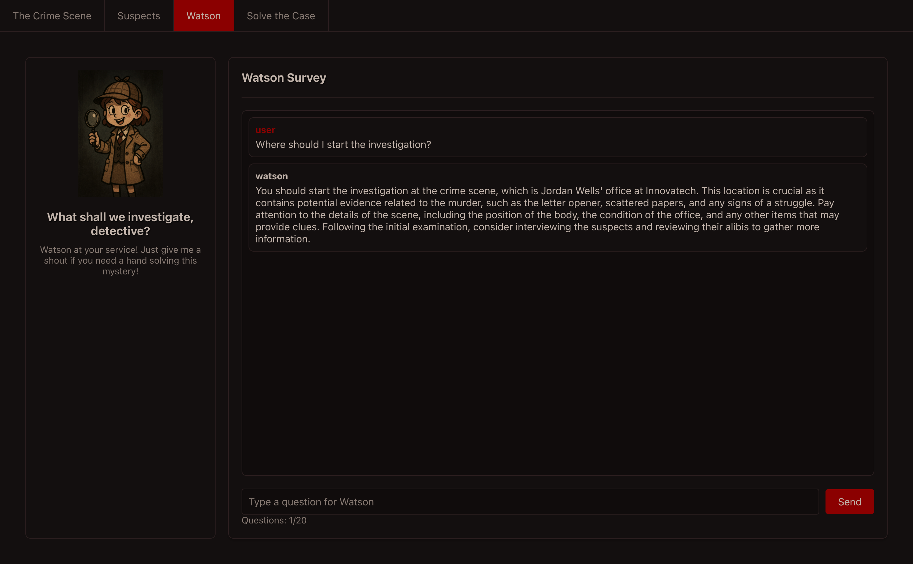

# 🔍 DETECTIVE INFINITY

> *Unleash your inner Sherlock Holmes in an AI-powered mystery adventure!*

[English](https://github.com/kanghohyeong/detective-infinity/blob/master/README.md) | [한국어](https://github.com/kanghohyeong/detective-infinity/blob/master/README.ko.md) | [中文](https://github.com/kanghohyeong/detective-infinity/blob/master/README.zh.md)

Welcome to **DETECTIVE INFINITY**, where every case is unique, every suspect has a story, and every mystery is crafted by cutting-edge AI. Step into the shoes of a brilliant detective and solve endless mysteries in this immersive chat-based adventure game.

## 🎮 What Makes It Special?

- **Infinite Mysteries**: Every playthrough is unique, with AI-generated cases, suspects, and plot twists
- **Immersive Experience**: Chat your way through investigations, interrogate suspects, and piece together clues
- **AI-Powered Storytelling**: Dynamic narratives that adapt to your choices and deductions
- **Watson AI Assistant**: Your trusty AI companion helping you crack the case
- **🌍 Global Language Support**: Play in any language you prefer - from English to Korean, Japanese to French, and everything in between!

## 🎯 Quick Start

Ready to solve your first case? [Play Now!](https://kanghohyeong.github.io/detective-infinity)

Want to tinker with the code? Clone the repository and start exploring!

## 📸 Case Files (Screenshots)

### The Crime Scene

### Interrogation Room

### Your AI Partner

### Solve the Case

## 🤝 Join the Investigation!

We're always looking for fellow detectives to help improve the game! Whether you're a:
- Frontend wizard who can enhance the UI/UX
- Prompt engineer who can craft better mysteries
- Game designer who can suggest new features

...we'd love to have you on the team! Check out our issues and pull requests to see how you can contribute.

## 📬 Get in Touch

Have a brilliant idea for a new case? Found a bug that needs solving? Want to share your experience? We'd love to hear from you!

- Email: [hobro.kang@gmail.com](mailto:hobro.kang@gmail.com)
- GitHub Issues: Open an issue to report bugs or suggest features

---

*Remember: In DETECTIVE INFINITY, every conversation could be a clue, every suspect has a motive, and every case is waiting for you to solve it!*
