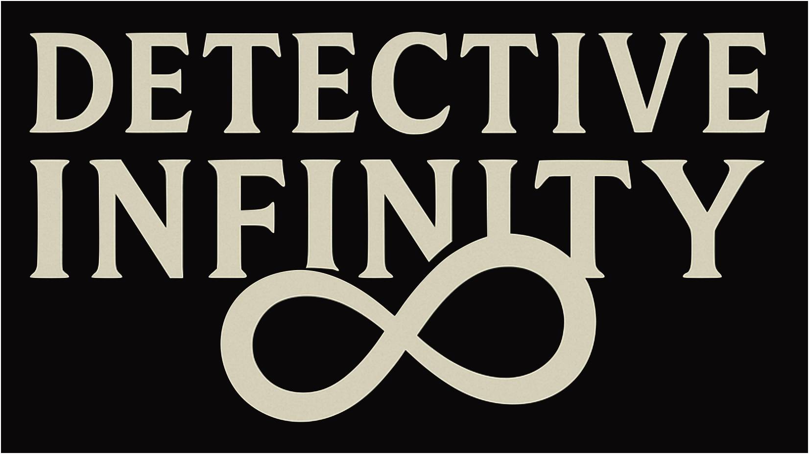
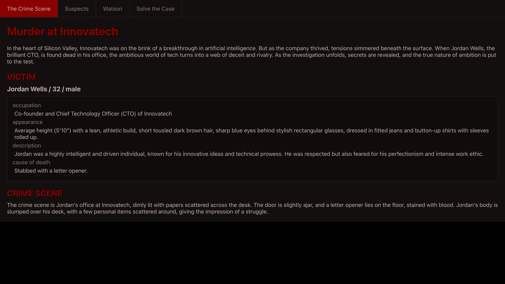
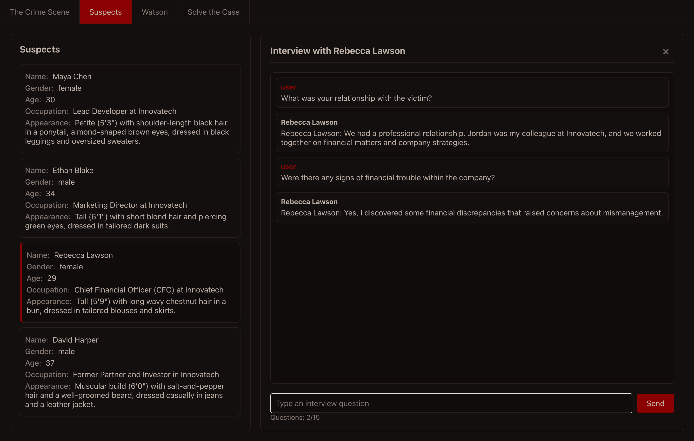
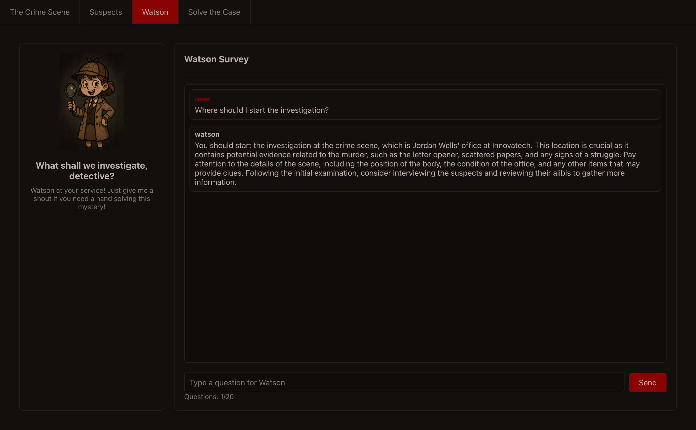
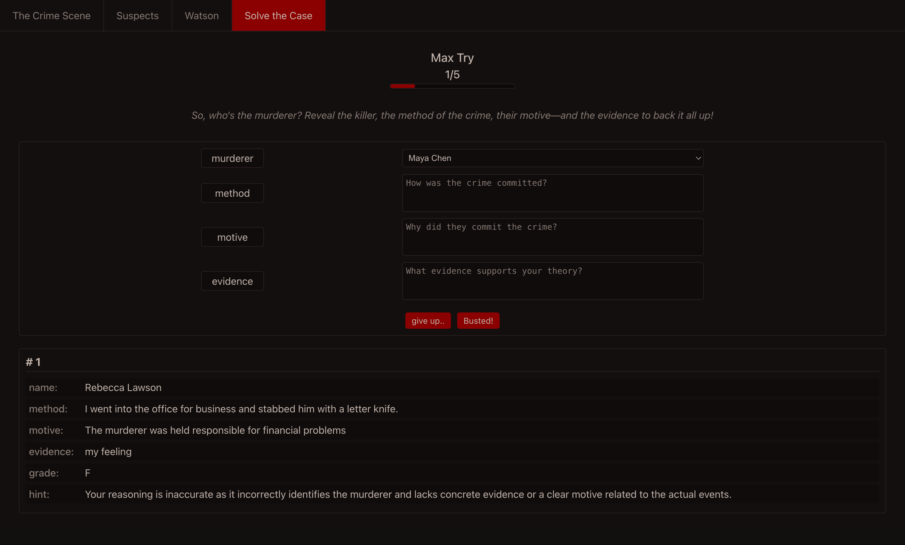

# 🔍 DETECTIVE INFINITY

> *在AI驱动的神秘冒险中，成为属于你的福尔摩斯！*

[English](https://github.com/kanghohyeong/detective-infinity/blob/master/README.md) | [한국어](https://github.com/kanghohyeong/detective-infinity/blob/master/README.ko.md) | [中文](https://github.com/kanghohyeong/detective-infinity/blob/master/README.zh.md)

欢迎来到 **DETECTIVE INFINITY**！在这里，每个案件都是独特的，每个嫌疑人都有自己的故事，每个谜题都由尖端AI精心打造。在这款沉浸式聊天冒险游戏中，开启你的侦探之旅吧。

## 🎮 特色亮点

- **无限谜题**：每次游戏都是全新的案件、嫌疑人和转折
- **沉浸式体验**：通过聊天进行调查，审讯嫌疑人，组合线索
- **AI驱动剧情**：根据你的选择和推理动态变化的故事情节
- **沃森AI助手**：你值得信赖的AI搭档，协助你破解案件
- **🌍 全球语言支持**：支持英语、中文、日语、法语等多种语言！

## 🎯 开始游戏

准备好解决你的第一个案件了吗？[立即开始！](https://kanghohyeong.github.io/detective-infinity)

想要修改代码？克隆仓库并开始探索吧！

## 📸 案件档案（截图）

### 犯罪现场

### 审讯室

### AI搭档

### 解决案件

## 🤝 加入我们！

我们一直在寻找志同道合的侦探来改进游戏！无论你是：
- 能提升UI/UX的前端魔法师
- 能创造更好谜题的提示工程师
- 能提出新功能的游戏设计师

...我们都欢迎你的加入！查看我们的Issues和Pull Requests，了解如何贡献。

## 📬 联系我们

有新的案件创意？发现了bug？想分享你的体验？我们期待听到你的声音！

- 邮箱：[hobro.kang@gmail.com](mailto:hobro.kang@gmail.com)
- GitHub Issues：通过提交Issue来报告bug或建议新功能

---

*记住：在DETECTIVE INFINITY中，每段对话都可能是线索，每个嫌疑人都有动机，每个案件都在等待你来破解！* 